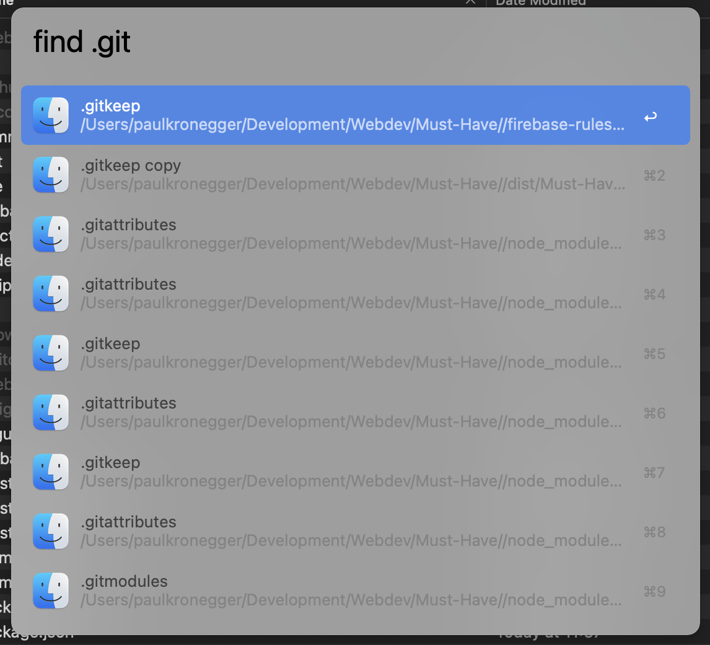

# Find/Search Hidden Files Workflow

Download the Workflow [here](https://github.com/Paul-creator/Find-Search-Hidden-Files-Alfred-Workflow/raw/temp/Find%20Hidden%20Files.alfredworkflow)

It is not possible to seach files with the normal `Alfred File Search` nor with the `MacOS File Search`.

With this workflow, however, you can! Just type `find <file>` to search for files in the upmost `Finder` window.

